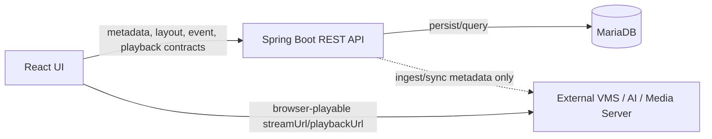

# Architecture Spine - Vision Monitor Camera Focus View

## Design Paradigm

이 기능은 기존 PoC를 확장하는 계층형 brownfield 구조를 따른다.



## Invariants & Rules

### AD-1 - 제품 경계 고정

- **Binds:** 전체 기능, AC-10
- **Prevents:** 확대 보기 구현 중 Spring Boot가 RTSP ingest, transcoding, media distribution, server-side overlay를 소유하는 설계로 회귀하는 것
- **Rule:** Vision Monitor는 외부 VMS/AI/Media Server가 제공하는 URL과 메타데이터를 조회/저장/표시한다. 영상 수신, 변환, 배포, 원본 저장, AI 추론, 서버 사이드 overlay는 외부 시스템 책임이다.

### AD-2 - 확대 보기는 라우트 중심 상태로 표현

- **Binds:** FR-1, FR-7, Live Grid 연결
- **Prevents:** Grid cell 내부의 임시 modal state와 상세 화면 route state가 서로 다른 진입/복구 규칙을 갖는 것
- **Rule:** MVP 확대 보기는 `/live/cameras/:cameraId?mode=live|recording&eventId={eventId}` 라우트로 진입한다. Grid는 `cameraId`를 넘겨 이동만 담당하고, 상세 화면이 데이터 로딩과 탭 상태를 소유한다.

### AD-3 - Live URL과 Playback URL 계약 분리

- **Binds:** FR-3, FR-4, NFR-7
- **Prevents:** 실시간 스트림 URL을 녹화 재생 URL처럼 재사용하거나, 시간 범위/만료/seek 지원이 섞이는 것
- **Rule:** 실시간은 `streamUrl` 계약, 녹화는 `playbackUrl` 계약으로 분리한다. `streamUrl`은 현재 재생 가능한 live source이고, `playbackUrl`은 요청 시간 범위와 seek 정책에 묶인 재생 세션 URL이다.

### AD-4 - Spring Boot는 persistence와 contract boundary

- **Binds:** backend API, database, 외부 연동
- **Prevents:** React가 외부 이벤트/녹화/카메라 메타데이터를 각자 직접 조회해 데이터 모양이 분산되는 것
- **Rule:** 카메라, 이벤트, 녹화, 알람, 레이아웃, 공정 메타데이터의 정규화된 계약은 Spring Boot API가 제공한다. React는 media URL을 재생할 때만 외부 Media Server URL을 직접 사용한다.

### AD-5 - 영상 실패와 메타데이터 실패는 독립 상태

- **Binds:** NFR-2, NFR-3, AC-7
- **Prevents:** player 오류가 우측 패널, 이벤트 목록, 알람 배너 전체를 무너뜨리는 것
- **Rule:** `camera`, `liveStream`, `playback`, `events`, `alerts` 로딩/오류 상태는 프론트엔드에서 별도로 관리한다. 하나의 실패는 해당 영역의 fallback UI만 갱신한다.

### AD-6 - 알람 배너 닫힘은 화면 세션 UI 상태

- **Binds:** FR-5, AC-5, AC-6
- **Prevents:** 활성 알람 polling/refetch마다 사용자가 닫은 배너가 즉시 다시 열리는 것
- **Rule:** MVP에서 배너 닫힘 상태는 `alertId + route session` 단위의 클라이언트 UI 상태다. 서버의 이벤트 확인/조치 상태와 동일시하지 않는다.

## Consistency Conventions

| Concern | Convention |
| --- | --- |
| API envelope | 기존 `ApiResponse<T>`의 `success`, `data`, `error`, `message`, `timestamp`를 유지한다. |
| IDs | Backend는 `Long id`, Frontend는 number `id`를 사용하고 API JSON은 camelCase로 노출한다. |
| Time | 서버 기준 시각은 ISO-8601 문자열로 주고, UI는 Asia/Seoul 표시 정책을 일관 적용한다. |
| Media URL | `streamUrl`과 `playbackUrl`은 opaque URL이다. Frontend는 URL 구조를 파싱해 비즈니스 판단을 하지 않는다. |
| Metadata | 이벤트 유형별 확장 필드는 `metadata` object에 둔다. 필드 부재는 UI에서 `-` 또는 `정보 없음`으로 표시한다. |
| Errors | 401/403/404/5xx는 영역별 오류 상태로 매핑한다. 권한 없음은 영상과 제한 메타데이터 모두에서 명시한다. |

## Stack

| Name | Version |
| --- | --- |
| React | ^19.0.0 |
| Vite | ^8.2.0 |
| TypeScript | ^5.3.3 |
| React Router | ^7.18.2 |
| Redux Toolkit | ^1.9.7 |
| Axios | ^1.6.8 |
| hls.js | ^1.4.15 |
| video.js | ^8.6.1 |
| Java | 21 |
| Spring Boot | 3.2.0 |
| MariaDB Java Client | 3.3.0 |
| Springdoc OpenAPI | 2.0.4 |

## Structural Seed

```text
frontend/src/
  pages/CameraFocus.tsx
  components/CameraFocus/
    CameraFocusShell.tsx
    FocusVideoStage.tsx
    FocusMetadataPanel.tsx
    FocusAlertBanner.tsx
    RecordingTimeline.tsx
    RecordingEventList.tsx
  components/Grid/
    DraggableCell.tsx
  components/StreamPlayer/
    LiveStreamPlayer.tsx
    StreamPlayerComponent.tsx
  services/
    cameraService.ts
    eventService.ts
    recordingService.ts

backend/src/main/java/com/vision/
  controller/
    CameraController.java
    EventController.java
    RecordingController.java
  service/
    CameraService.java
    EventService.java
    RecordingService.java
  dto/
    CameraFocusDto.java
    LiveStreamDto.java
    PlaybackSessionDto.java
    EventDto.java
    AlertDto.java
```

## Capability -> Architecture Map

| Capability / Area | Lives in | Governed by |
| --- | --- | --- |
| Grid에서 확대 보기 진입 | `GridContainer`, `DraggableCell`, router | AD-2 |
| 실시간 대형 영상 | `CameraFocus`, `LiveStreamPlayer`, `/api/cameras/{id}/live-stream` | AD-1, AD-3 |
| 녹화 재생 | `RecordingTimeline`, `StreamPlayerComponent`, `/api/cameras/{id}/playback` | AD-3, AD-5 |
| 우측 메타데이터 패널 | `FocusMetadataPanel`, `/api/cameras/{id}/focus` | AD-4, conventions |
| 활성 알람 배너 | `FocusAlertBanner`, `/api/cameras/{id}/alerts/active` | AD-5, AD-6 |
| 이벤트 선택 후 재생 이동 | `RecordingEventList`, route `eventId`, player seek | AD-2, AD-3 |

## Deferred

| Decision | Deferred Because |
| --- | --- |
| WebSocket/SSE push | MVP는 API 조회/polling으로 가능하고, PRD도 push를 후속 범위로 둔다. |
| PTZ 제어 | 외부 VMS 제어 권한/프로토콜이 필요하며 확대 보기 MVP와 독립적이다. |
| Browser AI overlay | PRD는 server-side overlay를 제외하고, overlay 표시 자체도 후속 확장이다. |
| 이벤트 확인/조치 워크플로 | MVP는 배너 닫힘과 이벤트 표시가 우선이며, 서버 ACK는 선택 사항이다. |
| Media Server 제품 선택 | Vision Monitor는 URL 소비자이므로 go2rtc/MediaMTX/VMS 선택은 외부 provider ADR로 분리한다. |
