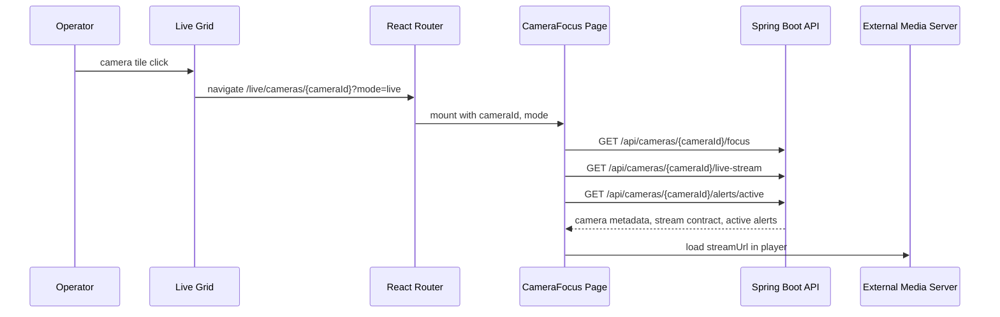
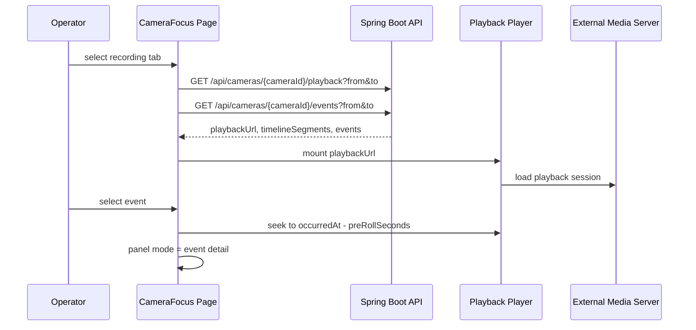

# Brownfield Architecture: 카메라 집중 보기 / 확대 보기

## 1. 목적과 현재 기준

이 문서는 Vision Monitor의 `카메라 집중 보기 / 확대 보기` 기능을 현재 저장소 상태에 맞춰 어떻게 구현할지 정의한다.

현재 기준은 다음과 같다.

| 영역 | 현재 상태 | 이 기능에서의 처리 |
| --- | --- | --- |
| Frontend | React/Vite PoC, Live Grid와 StreamPlayer 구현 존재 | 확대 보기 route와 컴포넌트 추가 |
| Live Grid | mock camera/layout 기반, `GridContainer -> DraggableCell -> LiveStreamPlayer` 흐름 | tile click으로 상세 route 진입 |
| StreamPlayer | iframe stream page, HLS, WebRTC, RTSP wrapper 존재 | 기존 player adapter 재사용 |
| Camera Detail | `CameraDetailView` 모달 PoC 존재 | 라우트 기반 focus view의 컴포넌트 seed로 재구성 |
| Backend | Spring Boot controller/service/repository/entity skeleton | persistence-backed API contract 구현 대상 |
| Media/AI/VMS | production integration 없음, go2rtc-style stream page PoC 존재 | 외부 시스템이 URL/metadata 제공 |

과거 `docs/ARCHITECTURE.md`에는 FFmpeg, RTSP ingest, HLS segmenter, WebRTC server가 Vision Monitor 내부 책임처럼 표현되어 있다. 이 기능의 architecture에서는 PRD와 brief의 제품 경계를 우선한다. Vision Monitor는 영상 처리 시스템이 아니라 운영 UI와 업무 API다.

## 2. 책임 경계

### 2.1 Frontend 책임

React는 운영자 경험과 화면 상태를 소유한다.

| 책임 | 설명 |
| --- | --- |
| 확대 보기 진입 | Live Grid tile에서 `/live/cameras/:cameraId`로 이동 |
| 실시간/녹화 탭 | `mode=live|recording` 상태를 route query와 UI state에 동기화 |
| 대형 영상 표시 | 기존 `LiveStreamPlayer`와 `StreamPlayerComponent`를 재사용 |
| 우측 패널 | camera, event, alert metadata를 영역별 상태로 표시 |
| 알람 배너 | 활성 알람 표시, route session 내 수동 닫힘 상태 관리 |
| 이벤트 재생 UX | 이벤트 선택 시 `eventId` 반영, 녹화 player seek 시각 결정 |
| 실패 분리 | 영상, metadata, event, alert 실패를 독립 UI로 처리 |

Frontend는 RTSP URL을 직접 해석해 ingest하거나 외부 이벤트를 정규화하지 않는다. Media URL은 player adapter에만 전달한다.

### 2.2 Backend 책임

Spring Boot는 데이터와 계약의 source of truth를 소유한다.

| 책임 | 설명 |
| --- | --- |
| Camera API | 카메라 기본 정보, 공정/구역, 권한 결과, live stream URL contract 제공 |
| Event API | 카메라별 이벤트 목록/상세, 알람 연결, metadata 제공 |
| Recording API | 녹화 재생 가능 범위, playback session URL, timeline segment 제공 |
| Alert API | 활성 알람 조회, 관련 이벤트 연결, severity/message/location 제공 |
| Layout API | 현재 Live Grid의 사용자/공정/카메라 배치 persistence boundary |
| Persistence | MariaDB entity/repository/service로 카메라, 이벤트, 녹화 index, layout 저장 |

Backend는 media stream을 proxy하거나 생성하지 않는다. 외부 VMS/Media Server가 제공하는 URL과 상태를 저장하거나 조회해 브라우저에 전달한다.

### 2.3 External System 책임

외부 VMS/AI/Media Server는 영상과 AI 원천 기능을 소유한다.

| 외부 시스템 | 책임 |
| --- | --- |
| VMS/Media Server | browser-playable `streamUrl`, 시간 범위 기반 `playbackUrl`, 녹화 availability 제공 |
| AI System/VMS Event Producer | 이벤트 발생 시각, 유형, severity, metadata, 관련 cameraId 제공 |
| External Overlay Producer | 영상에 합성된 overlay가 필요하면 외부에서 합성된 stream/playback 제공 |

Vision Monitor는 외부 시스템의 URL을 opaque value로 취급한다. 인증이 필요한 경우 단기 만료 signed URL 또는 외부 gateway 인증 정책을 계약에 포함한다.

## 3. Runtime 흐름

### 3.1 Grid에서 확대 보기 진입



### 3.2 녹화 탭과 이벤트 재생



### 3.3 알람 발생 시 UI 상태 흐름

MVP는 push가 아니라 조회 또는 짧은 polling으로 시작할 수 있다.

```text
initial route enter
  -> alerts.loading
  -> GET /api/cameras/{cameraId}/alerts/active
  -> active alerts empty: banner hidden, panel stays camera mode
  -> active alerts exists:
       if alertId is not dismissed in this route session:
         banner visible
       panel mode = alert detail when relatedEventId exists

operator closes banner
  -> dismissedAlertIds.add(alertId)
  -> banner hidden for current route session
  -> server event status unchanged

new alertId arrives
  -> banner visible
  -> panel can switch to alert detail
```

서버 ACK와 UI 닫힘은 다른 상태다. `POST /api/events/{eventId}/acknowledge`는 운영 확인/조치 이력 기능이 활성화될 때만 서버 상태를 바꾼다.

## 4. API Contract

기존 wrapper를 유지한다.

```json
{
  "success": true,
  "data": {},
  "error": null,
  "message": null,
  "timestamp": "2026-08-15T09:00:00"
}
```

### 4.1 카메라 확대 보기 메타데이터

`GET /api/cameras/{cameraId}/focus`

`GET /api/cameras/{cameraId}`를 확장해도 되지만, focus 화면의 aggregation이 필요하므로 별도 endpoint를 권장한다.

```json
{
  "cameraId": 1,
  "cameraName": "Entry Zone CAM-01",
  "processType": "가열",
  "zoneName": "Entry Zone",
  "lineName": "Line 1",
  "location": "제조 구역 A",
  "status": "online",
  "recordingEnabled": true,
  "capabilities": {
    "live": true,
    "recording": true,
    "ptz": false,
    "overlay": false
  },
  "lastSeenAt": "2026-08-15T08:59:30+09:00",
  "recentEventSummary": {
    "lastEventId": 50001,
    "lastSeverity": "warning",
    "lastOccurredAt": "2026-08-15T08:55:00+09:00",
    "openCount": 2
  }
}
```

상태 값:

| Field | Values |
| --- | --- |
| `status` | `online`, `offline`, `error`, `maintenance`, `forbidden` |
| `processType` | `ALL`, `가열`, `압연`, `냉각`, `시험`, `정정` 또는 서버 등록 값 |

### 4.2 실시간 URL 계약

`GET /api/cameras/{cameraId}/live-stream`

```json
{
  "cameraId": 1,
  "streamUrl": "http://media.example.local/stream.html?src=video_high1",
  "streamProtocol": "stream_page",
  "expiresAt": "2026-08-15T09:05:00+09:00",
  "status": "active",
  "resolution": "1920x1080",
  "fps": 30,
  "metadata": {
    "provider": "external-vms",
    "latencyClass": "live"
  }
}
```

규칙:

| 항목 | 계약 |
| --- | --- |
| URL 목적 | 현재 시점의 live 재생 |
| 시간 파라미터 | 없음 |
| seek | 지원하지 않음 |
| 만료 | signed URL이면 짧은 `expiresAt` 필수 |
| protocol | `stream_page`, `hls`, `webrtc`, `rtsp_bridge`, `unknown` |
| frontend 처리 | `streamProtocol` 또는 URL detection으로 기존 StreamPlayer adapter 선택 |

### 4.3 녹화 URL 계약

`GET /api/cameras/{cameraId}/playback?from={isoDateTime}&to={isoDateTime}&eventId={eventId?}`

```json
{
  "cameraId": 1,
  "playbackUrl": "https://media.example.local/playback/session/abc123/index.m3u8",
  "playbackProtocol": "hls",
  "sessionId": "abc123",
  "expiresAt": "2026-08-15T09:15:00+09:00",
  "availableFrom": "2026-08-15T08:00:00+09:00",
  "availableTo": "2026-08-15T09:00:00+09:00",
  "seekable": true,
  "preRollSeconds": 10,
  "timelineSegments": [
    {
      "from": "2026-08-15T08:00:00+09:00",
      "to": "2026-08-15T08:30:00+09:00",
      "status": "available"
    },
    {
      "from": "2026-08-15T08:30:00+09:00",
      "to": "2026-08-15T08:35:00+09:00",
      "status": "gap"
    }
  ]
}
```

규칙:

| 항목 | 계약 |
| --- | --- |
| URL 목적 | 특정 시간 범위의 playback session |
| 시간 파라미터 | `from`, `to` 필수 |
| seek | `seekable`로 명시 |
| gap | `timelineSegments.status = gap`으로 UI 표시 |
| event selection | `occurredAt - preRollSeconds`를 seek target으로 사용 |
| lifecycle | session URL 만료 시 같은 endpoint를 재호출 |

### 4.4 이벤트 목록

`GET /api/cameras/{cameraId}/events?from={isoDateTime}&to={isoDateTime}&severity={optional}&status={optional}`

```json
{
  "content": [
    {
      "eventId": 50001,
      "cameraId": 1,
      "eventType": "entry_zone_jam",
      "severity": "warning",
      "title": "Entry Zone 치입불 발생",
      "occurredAt": "2026-08-15T08:55:00+09:00",
      "endedAt": null,
      "status": "active",
      "metadata": {
        "controlResponse": "자동 감속",
        "materialId": "M-20260815-001",
        "coolingCode": "C2",
        "speed": "1.2m/s",
        "holdTimeSeconds": 35
      }
    }
  ],
  "page": 0,
  "size": 50,
  "totalElements": 1
}
```

`metadata`는 유형별 확장 필드다. Backend는 JSON을 저장하되, API DTO에서는 object로 그대로 반환한다.

### 4.5 이벤트 상세

`GET /api/events/{eventId}`

상세 패널과 playback deep link에 필요한 단일 이벤트 정보를 반환한다.

```json
{
  "eventId": 50001,
  "cameraId": 1,
  "eventType": "entry_zone_jam",
  "severity": "warning",
  "title": "Entry Zone 치입불 발생",
  "occurredAt": "2026-08-15T08:55:00+09:00",
  "status": "active",
  "playbackHint": {
    "from": "2026-08-15T08:54:00+09:00",
    "to": "2026-08-15T08:57:00+09:00",
    "seekAt": "2026-08-15T08:54:50+09:00"
  },
  "metadata": {}
}
```

### 4.6 활성 알람

`GET /api/cameras/{cameraId}/alerts/active`

```json
[
  {
    "alertId": 90001,
    "cameraId": 1,
    "severity": "warning",
    "message": "[경고!] Entry Zone 치입불 발생 중",
    "location": "Entry Zone",
    "startedAt": "2026-08-15T08:55:00+09:00",
    "status": "active",
    "relatedEventId": 50001,
    "metadata": {
      "controlResponse": "자동 감속",
      "materialId": "M-20260815-001"
    }
  }
]
```

활성 알람이 없으면 `[]`를 반환한다.

### 4.7 이벤트 확인 처리

`POST /api/events/{eventId}/acknowledge`

MVP에서는 선택 사항이다. 구현하면 다음 응답을 따른다.

```json
{
  "eventId": 50001,
  "status": "acknowledged",
  "acknowledgedBy": 1,
  "acknowledgedAt": "2026-08-15T09:02:00+09:00"
}
```

현재 frontend service는 `PUT /events/{eventId}/acknowledge`를 호출한다. PRD는 `POST`를 요구한다. 구현 전 둘 중 하나로 정리해야 하며, 새 계약은 `POST`를 권장한다.

## 5. Frontend Component 구조

권장 route:

```tsx
<Route
  path="/live/cameras/:cameraId"
  element={
    <AppLayout>
      <CameraFocus />
    </AppLayout>
  }
/>
```

권장 컴포넌트:

```text
pages/CameraFocus.tsx
  - route params/query 파싱
  - camera focus data hooks 호출
  - mode/eventId URL 동기화

components/CameraFocus/CameraFocusShell.tsx
  - 공정 탭, 실시간/녹화 탭, 화면 layout

components/CameraFocus/FocusVideoStage.tsx
  - mode=live: LiveStreamPlayer
  - mode=recording: StreamPlayerComponent + playback source
  - player status bridge

components/CameraFocus/FocusMetadataPanel.tsx
  - camera info, event detail, alert detail panel mode

components/CameraFocus/FocusAlertBanner.tsx
  - active alert banner
  - dismissedAlertIds session state

components/CameraFocus/RecordingTimeline.tsx
  - timelineSegments, current playback time, event markers

components/CameraFocus/RecordingEventList.tsx
  - events list
  - event select -> route eventId update + player seek
```

권장 hooks/service:

```text
hooks/useCameraFocus.ts
  - camera focus metadata
  - live stream contract
  - active alerts

hooks/useCameraPlayback.ts
  - playback session loading
  - timeline segments
  - event-driven seek target

services/recordingService.ts
  - getCameraPlayback(cameraId, from, to, eventId?)
```

기존 컴포넌트 연결:

| 기존 구조 | 변경 방향 |
| --- | --- |
| `Live.tsx` | mock layout 유지 가능. backend 전환 전까지 현재 grid source 유지 |
| `GridContainer` | camera tile action prop 또는 `DraggableCell` click handler 추가 |
| `DraggableCell` | drag handle과 focus click target을 분리. click 시 navigate |
| `LiveStreamPlayer` | live focus player에 그대로 재사용 |
| `StreamPlayerComponent` | recording playback source 재생에 재사용 |
| `CameraDetailView` | 모달 PoC를 `FocusMetadataPanel`, `FocusVideoStage` seed로 분해 |
| `eventService` | camera events, event detail, acknowledge contract 정리 |
| `layoutSlice` | grid active tab 복귀 상태 유지에만 관여. focus page 내부 상태를 소유하지 않음 |

## 6. Frontend 상태 모델

```ts
type FocusMode = 'live' | 'recording'
type PanelMode = 'camera' | 'event' | 'alert'

interface CameraFocusUiState {
  cameraId: number
  processTab: 'ALL' | '가열' | '압연' | '냉각' | '시험' | '정정' | string
  mode: FocusMode
  selectedEventId?: number
  panelMode: PanelMode
  videoStatus: 'idle' | 'loading' | 'playing' | 'interrupted' | 'error' | 'forbidden'
  dismissedAlertIds: number[]
  playbackCurrentTime?: string
}
```

서버 데이터 상태는 다음처럼 분리한다.

| State | Source | Failure UI |
| --- | --- | --- |
| `cameraFocus` | `/api/cameras/{id}/focus` | 우측 패널 camera info 오류 |
| `liveStream` | `/api/cameras/{id}/live-stream` | 영상 영역 오류 |
| `playbackSession` | `/api/cameras/{id}/playback` | 녹화 player/timeline 오류 |
| `events` | `/api/cameras/{id}/events` | 이벤트 목록 오류 |
| `alerts` | `/api/cameras/{id}/alerts/active` | 배너 미표시 + 패널 경고 |

## 7. Backend 구조 연결

### 7.1 Controller

```text
CameraController
  GET /api/cameras
  GET /api/cameras/{id}
  GET /api/cameras/{id}/focus
  GET /api/cameras/{id}/live-stream
  GET /api/cameras/{id}/alerts/active

EventController
  GET /api/events/{id}
  GET /api/cameras/{cameraId}/events
  POST /api/events/{id}/acknowledge

RecordingController
  GET /api/cameras/{cameraId}/playback
```

현재 `RecordingController`의 class mapping은 `/api/recordings`다. `GET /api/cameras/{cameraId}/playback`을 추가하려면 `CameraController`에 위임하거나 별도 controller mapping을 추가해야 한다. 소비자 관점에서는 카메라 중심 URL이 focus view에 더 적합하다.

### 7.2 Service

```text
CameraService
  - camera metadata 조회
  - live stream contract 조립
  - 권한/상태 판단 결과 포함

EventService
  - camera event range query
  - event detail
  - acknowledge optional workflow
  - active alert projection

RecordingService
  - external playback availability/session 조회 또는 persisted recording index 조회
  - playbackUrl, timelineSegments 조립
```

### 7.3 Persistence

기존 schema를 MVP에 맞춰 사용할 수 있다.

| Table | 사용 |
| --- | --- |
| `cameras` | 기본 metadata, zone, stream_url, status |
| `streams` | 복수 stream URL/protocol을 관리할 경우 사용 |
| `events` | AI/VMS event metadata 저장 |
| `recordings` | 외부 녹화 index 또는 playback 가능 구간 cache |
| `layouts` | Live Grid 배치와 복귀 context |

필요한 migration 후보:

| 변경 | 이유 |
| --- | --- |
| `cameras.process_type`, `line_name`, `zone_name` 또는 metadata JSON | PRD의 공정/라인/구역 표시 |
| `streams.protocol` 또는 `stream_protocol` 정규화 | frontend의 `streamProtocol`과 backend stream `type` 불일치 해소 |
| `recordings.playback_url` 또는 external reference | playbackUrl을 file_path와 분리 |
| `events.title`, `occurred_at`, `status` naming 정리 | PRD/API 계약과 현재 `type`, `description`, `event_time`, `acknowledged`의 차이 해소 |

## 8. MVP 구현 범위

MVP에 포함한다.

| Area | 구현 |
| --- | --- |
| Route | `/live/cameras/:cameraId?mode=live|recording&eventId=` |
| Grid 진입 | 카메라 tile click 또는 explicit focus button |
| Live player | `GET /focus`, `GET /live-stream`, 기존 `LiveStreamPlayer` 재사용 |
| Recording player | `GET /playback`, timeline, event list, event seek |
| Metadata panel | camera/event/alert panel modes |
| Alert banner | active alerts 조회, 노란색 배너, 수동 닫힘 |
| Error handling | API 영역별 실패, player 실패, forbidden 표시 |
| Backend | camera focus/live-stream/events/playback/active-alerts API skeleton을 persistence-backed로 구현 |

MVP에서 제외한다.

| Area | 제외 이유 |
| --- | --- |
| RTSP ingest/transcoding | 제품 경계 밖 |
| AI inference | 제품 경계 밖 |
| Media Server 구현 | 제품 경계 밖 |
| Server-side overlay | 제품 경계 밖 |
| PTZ | 외부 제어 계약 필요 |
| 다중 카메라 비교 확대 | 단일 camera focus 이후 확장 |
| SSE/WebSocket push | polling/refetch로 MVP 가능 |
| 이벤트 편집/삭제 | 운영 확인 UX와 별도 workflow |

## 9. 후속 확장 범위

| Extension | Architecture 영향 |
| --- | --- |
| SSE/WebSocket 알람 push | `EventController` 또는 dedicated realtime controller 추가, alert state refresh trigger로 사용 |
| 다중 카메라 비교 보기 | route에 cameraId list 도입, player resource budget 정책 필요 |
| PTZ 제어 | 외부 VMS command API proxy/permission/audit 계약 필요 |
| Browser metadata overlay | event metadata timestamp와 video clock sync 정책 필요 |
| 이벤트 확인/조치 이력 | acknowledge/comment/action tables와 audit log 필요 |
| 공정별 metadata template | processType별 panel schema/config 필요 |
| 외부 VMS deep link | event/camera detail에 externalLink 추가 |

## 10. ADR 후보

1. **ADR: Vision Monitor media responsibility boundary**
   - 결정 후보: media ingest/transcode/distribution은 외부 시스템 책임, Vision Monitor는 URL 소비자.
   - 지금 문서에서 사실상 채택됨.

2. **ADR: Camera focus route vs modal**
   - 결정 후보: MVP는 route 기반 `/live/cameras/:cameraId`를 사용하고 modal은 보조 UI로만 사용.
   - 이유: 새로고침 복원, event deep link, 뒤로가기 동작이 명확해진다.

3. **ADR: Live streamUrl and recording playbackUrl split**
   - 결정 후보: live와 playback API를 분리한다.
   - 이유: 시간 범위, seek, signed URL 만료, 오류 상태가 다르다.

4. **ADR: Event acknowledge method**
   - 결정 후보: PRD의 `POST /api/events/{eventId}/acknowledge`로 통일할지, 현재 frontend의 `PUT`을 유지할지 정한다.
   - 권장: 상태 전이를 생성하는 command 성격이므로 `POST`로 통일.

5. **ADR: Polling first vs SSE first for active alerts**
   - 결정 후보: MVP는 조회/polling, 후속으로 SSE/WebSocket push.
   - 이유: 현재 backend skeleton에서 SSE 구현보다 focus view API 완성이 우선.

6. **ADR: Playback endpoint ownership**
   - 결정 후보: 카메라 중심 `/api/cameras/{cameraId}/playback`을 `CameraController`에 둘지, `RecordingController`에 둘지 정한다.
   - 권장: controller는 별도여도 route는 camera-centered contract 유지.

7. **ADR: Metadata schema strategy**
   - 결정 후보: 이벤트별 확장 필드는 JSON `metadata`, 공통 필드는 top-level로 승격.
   - 이유: 제조 공정별 필드 차이를 수용하면서 목록/필터 공통 UX를 유지한다.

## 11. 구현 순서 제안

1. Backend DTO와 endpoint contract를 먼저 고정한다.
2. `cameraService`, `eventService`, 신규 `recordingService`의 TypeScript 타입을 API contract와 맞춘다.
3. `CameraFocus` route와 shell을 만들고 mock/fallback data로 UI skeleton을 연결한다.
4. Grid tile click에서 route 진입을 연결한다.
5. live mode에서 기존 `LiveStreamPlayer`를 연결한다.
6. recording mode에서 playback session, timeline, event list, event seek를 연결한다.
7. active alert banner와 panel mode 전환을 연결한다.
8. 영역별 실패와 forbidden 상태 테스트를 추가한다.

## 12. 검증 기준

| Criterion | 검증 |
| --- | --- |
| Grid 진입 | tile click 후 `/live/cameras/{cameraId}` 표시 |
| Live URL 분리 | live mode가 `/live-stream`의 `streamUrl`만 사용 |
| Playback URL 분리 | recording mode가 `/playback`의 `playbackUrl`만 사용 |
| Event seek | event click 후 query `eventId`와 player seek target 변경 |
| Alert dismiss | 같은 route session에서 닫은 `alertId` 재표시 없음 |
| Partial failure | playback 실패해도 camera metadata panel 유지 |
| Product boundary | backend에 ingest/transcode/media distribution 구현 없음 |
